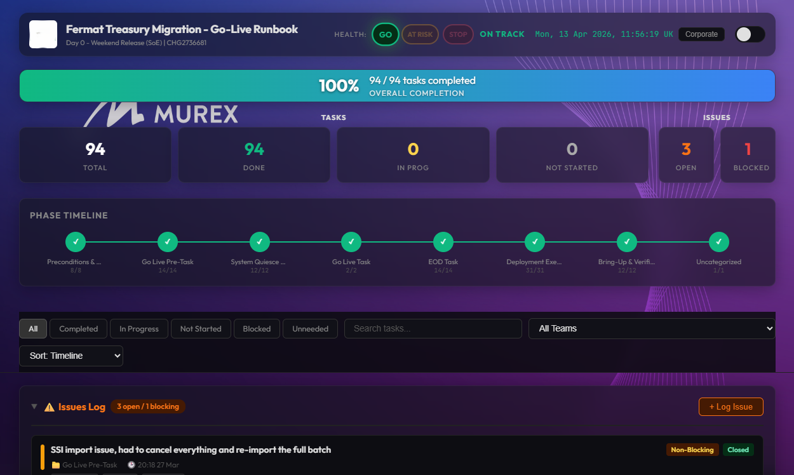
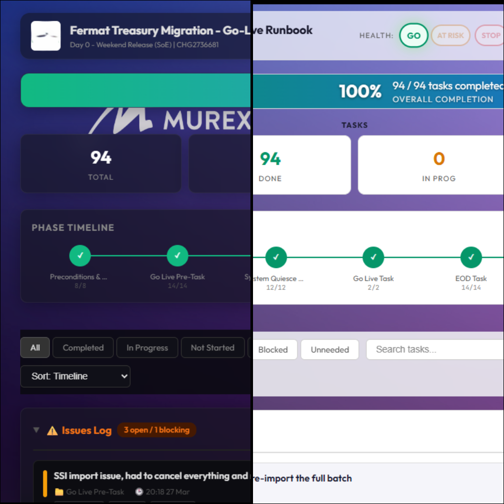
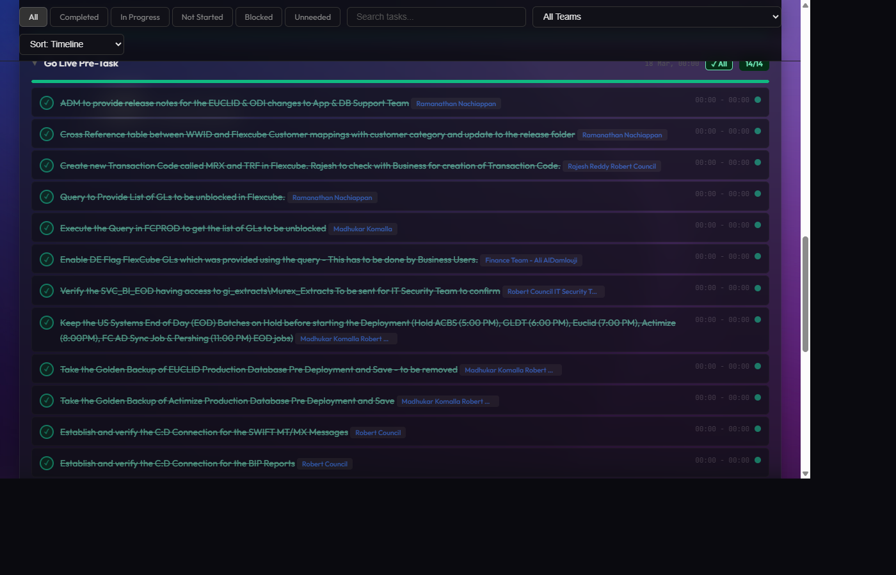

# Go-Live Runbook Dashboard

A lightweight, zero-infrastructure monitoring tool for production go-live events. Track task progress, export status snapshots, and share updates — all from a single HTML page opened in a browser.

Built for short-lived, high-pressure events (releases, migrations, cutovers) where teams need real-time visibility without setting up servers or deployments.



---

## Features

- **5-state task tracking**: Not Started → In Progress → Completed → Blocking → Unneeded (click to cycle)
- **Category progress**: Collapsible task groups with progress bars
- **Health indicator**: Green / Amber / Red go-live health with one-click toggle
- **Issues log**: Full CRUD panel for tracking issues (blocking / non-blocking, ongoing / closed)
- **3 image exports**:
  - Phone (1080×1920 portrait) — optimized for WhatsApp sharing
  - Email (1920×1080 landscape) — corporate style for email updates
  - Gantt chart (1920×dynamic) — timeline visualization with NOW line, planned-end marker
- **Text summary**: Copy-paste-ready status summary with operator comments
- **Dark/Light mode**: Toggle between dark (default) and light themes
- **Client branding**: Auto-detects logo and background from `assets/` folder
- **Offline**: Everything runs locally, no network required after initial load
- **State persistence**: Progress saved to browser localStorage

### v2 task fields (optional, sourced from Excel)

When your runbook spreadsheet includes extra columns, the adapter maps them to these v2 fields and the dashboard displays them in-line on each task row:

| Field | Dashboard display | Example |
|-------|-------------------|---------|
| `taskId` | Yellow `#ID` badge | `#15` |
| `system` | Cyan outlined pill | `MX/PROD` |
| `party` | Colored filled badge | `Client` / `Murex` / `Joint` |
| `estimatedEnd` | Planned-end baseline for Gantt & delta display | `2026-04-15T14:00` |
| `endTime` | Actual end — click-to-edit inline on the task row | `13:45` |
| `comment` | Amber 💬 note button → inline textarea editor | operator notes |

Enable them in your `mapping.yml`:
```yaml
columns:
  # ... required columns ...
  taskId:  "Task Id"
  system:  "System"
  party:   "Owner"          # values: Client / Murex / Joint
  estimatedEnd: "Planned End"
  endTime: "Actual End"
  comment: "Comments"
```

### Dark & Light themes


### Task list


---

## Quick Start

> **TL;DR**: Convert your runbook spreadsheet → start a local server → open the dashboard.

### Prerequisites

| Requirement | Why |
|-------------|-----|
| **Node.js** (any version) | To run the local dev server (`_serve.js`) |
| **Python 3.10+** | To convert source files (CSV/Excel) into `runbook.json` |
| `pip install pyyaml` | If using `.yml` mapping files |
| `pip install openpyxl` | If converting from Excel `.xlsx` |

### 1. Clone / copy the project

Copy these files to your working folder:
```
runbookDashboard.html
_serve.js
config.json
mapping.yml
adapter/          (entire folder)
dashboard/        (entire folder)
assets/           (create empty)
```

### 2. Configure your project — `config.json`

```json
{
  "projectName": "Your Project Name",
  "subtitle": "Release Phase Description",
  "changeRef": "CHG0000000",
  "client": "Client Name",
  "environment": "PROD",
  "release": "v1.0",
  "accentColor": "#003a2d",
  "runbookFile": "runbook.json"
}
```

`accentColor` is used in canvas exports (top bar, footer). Use the client's brand color.
`runbookFile` sets the JSON file the dashboard loads. Defaults to `runbook.json` if omitted — useful when managing multiple projects in the same folder.

### 3. Map your data columns — `mapping.yml`

Map your source file's columns to the dashboard fields:
```yaml
columns:
  task: "Activity Description"     # Column header for the task text
  status: "Current Status"         # Column header for status
  startTime: "Planned Start"       # Optional: start time column
  endTime: "Planned End"           # Optional: end time column
  item: "Task ID"                  # Optional: item label column
  # v2 optional fields
  taskId:  "Task Id"               # Optional: task reference ID
  system:  "System"                # Optional: system/component tag
  party:   "Owner"                 # Optional: Client / Murex / Joint
  estimatedEnd: "Planned End"      # Optional: planned end (for Gantt delta)
  comment: "Comments"              # Optional: operator notes column

category_column: "Phase"           # Column that groups tasks into categories
default_category: "Tasks"          # Fallback if a row has no category

status_mapping:                    # Map source values → dashboard statuses
  "Done": "Completed"
  "WIP": "In Progress"
  "Pending": "Not Started"

category_mapping:                  # Fix typos or encoding issues
  "Deplymnt": "Deployment"
```

**Dashboard statuses**: `Completed`, `In Progress`, `Not Started`, `Blocking`, `Unneeded`

### 4. Add branding (optional)

Drop files into `assets/`:
- Logo: `clientLogo-<anything>.png` (e.g., `clientLogo-acme.png`)
- Background: `background-<anything>.jpg` (e.g., `background-dark.jpg`)

The dashboard auto-detects files by prefix — no config needed.

### 5. Convert your runbook

```bash
python adapter/convert.py --source your_runbook.csv --mapping mapping.yml
```

Other examples:
```bash
# Excel source
python adapter/convert.py --source your_runbook.xlsx --mapping mapping.yml

# Custom output path
python adapter/convert.py --source your_runbook.csv --mapping mapping.yml --output runbook.json

# Validate an existing file
python adapter/convert.py --validate runbook.json
```

> The converter preserves `_issues` and `_health` from any existing `runbook.json`, so re-running it during a live event won't wipe saved progress.

### 6. Start the server and open the dashboard

```bash
node _serve.js
```

Then open **http://localhost:8090/** in your browser.

That's it. You should see the dashboard with your data loaded.

> **Alternative**: If you don't have Node.js, use Python's built-in server:
> ```bash
> python -m http.server 8090 --bind 127.0.0.1
> ```
> Then open `http://localhost:8090/runbookDashboard.html`

---

## Portable Distribution (No Install)

For users with no Node.js or Python available, two distribution options exist:

### Option A — Single portable HTML file

A completely self-contained HTML file with all JS, config, and assets base64-inlined. Works by double-clicking in any browser — no server required.

```bash
npm run build         # config + assets inlined, user loads runbook via "Load File"
npm run build:full    # also inlines runbook.json (fully self-contained)
```

Output: `dist/runbookDashboard-portable.html`

> Image exports (Phone / Email / Gantt) require an internet connection for html2canvas CDN. Google Fonts also requires internet; the dashboard falls back to system fonts if offline.

### Option B — Portable Windows executable

A standalone `RunbookDashboard.exe` that bundles the Node.js runtime + HTTP server. Users copy the folder, double-click the exe, and the dashboard opens in their browser automatically.

**Build the exe:**
```bash
npm run build:exe
```

**Build the exe and zip a ready-to-share release package:**
```bash
npm run build:package          # rebuilds exe, then zips
npm run build:package:zip      # zip only (reuses existing exe)
```

Output: `dist/RunbookDashboard-v<version>-portable.zip`

**Contents of the zip:**
```
RunbookDashboard.exe      ← double-click to start (auto-opens browser)
runbookDashboard.html
config.json               ← edit this for your project
runbook.json              ← your task data
dashboard/                ← JS source modules
assets/assets/
  Murex_background6.jpg
```

**To deploy to end users** (no Node/Python needed on their machine):
1. Extract the zip to any local folder
2. Edit `config.json` with your project details
3. Replace `runbook.json` with your task data
4. Double-click `RunbookDashboard.exe`

> The exe auto-detects a free port (starts at 8090, tries 8091, 8092…) and opens the browser automatically. Progress is saved to the browser's localStorage.

---

## Limitations

**This tool is not:**

- **A runbook authoring tool** — it does not create runbooks from scratch. It consumes a pre-existing runbook (CSV or Excel) and converts it into a displayable format.
- **A real-time collaboration tool** — there is no server, no database, and no sync between users. Each operator works on their own local copy. Progress is stored in the browser's `localStorage` and is lost if the cache is cleared or a different browser/machine is used.
- **A zero-setup tool** — it requires Python 3.10+ on the machine to convert source files, and a local HTTP server to serve the dashboard correctly. Opening the HTML file directly in a browser without a server will fail to load `runbook.json` and `config.json`.
- **An automated tracker** — statuses must be updated manually by the operator. The tool has no awareness of actual system state, CI/CD pipelines, or deployment logs.
- **An alerting or notification system** — there are no push alerts, emails, or escalation triggers. The health indicator (Green / Amber / Red) is set manually.
- **Persistent across sessions by default** — if `Save Progress` is not clicked (or `Ctrl+S`), unsaved changes are lost on page refresh. Saved state is browser-local only.
- **A Gantt chart generator without time data** — the Gantt export requires `startTime` and `endTime` fields populated in `runbook.json`. Tasks without time data will not appear on the chart.
- **Guaranteed to paste correctly into all email clients** — the email summary copy function works best with Outlook on Windows. Other clients may strip formatting.

---

## Architecture

```
runbook-dashboard/
├── runbookDashboard.html    ← Dashboard HTML + CSS
├── _serve.js                ← Dev server (Node.js, port 8090)
├── _launcher.js             ← Portable server (bundled into exe)
├── _bundle.js               ← Build script → single portable HTML
├── _package.js              ← Build script → portable zip release
├── config.json              ← Project-specific metadata
├── mapping.yml              ← Column mapping for source runbook
├── runbook.json             ← Task data (generated, never hand-edit)
├── dashboard/               ← Modular JS (ES modules)
│   ├── app.js               ← Entry point, render loop, event wiring
│   ├── state.js             ← Global state
│   ├── constants.js         ← Status labels, class mappings
│   ├── selectors.js         ← Derived queries (stats, filters, system list)
│   ├── persistence.js       ← localStorage, JSON export/import
│   ├── validation.js        ← Status normalization, v2 field defaults
│   ├── actions/             ← User interaction handlers
│   │   ├── health.js
│   │   ├── issues.js
│   │   └── tasks.js         ← setTaskStatus, setAssignee, setEndTime, setComment
│   ├── render/              ← DOM rendering (targeted patches)
│   │   ├── categories.js    ← Task rows with v2 badges, inline editing
│   │   ├── issues.js
│   │   ├── stats.js
│   │   ├── summary.js       ← Includes comment rows in HTML export
│   │   └── timeline.js
│   └── export/              ← Canvas image exports + theme
│       ├── gantt.js         ← Gantt with planned-end (P) marker
│       └── ...
├── assets/
│   ├── clientLogo-*.png     ← Client logo (auto-detected)
│   └── background-*.jpg     ← Background image (auto-detected)
├── adapter/
│   ├── convert.py           ← CLI: source file → runbook.json
│   ├── schema.py            ← JSON validation (incl. v2 fields)
│   ├── quality.py           ← Quality checks (time conflicts, party values)
│   └── parsers/
│       ├── excel_parser.py  ← Excel parser, maps v2 columns
│       └── generic_csv.py
├── dist/                    ← Build outputs (git-ignored)
│   ├── RunbookDashboard.exe            ← Portable Windows server
│   ├── runbookDashboard-portable.html  ← Single-file HTML build
│   └── RunbookDashboard-v*-portable.zip← Shareable release package
└── tests/                   ← Vitest unit tests
```

See [ARCHITECTURE.md](ARCHITECTURE.md) for the full technical reference.

---

## runbook.json Format

The dashboard expects this structure:
```json
{
  "Category Name": [
    {
      "task": "Description of the task",
      "status": "Not Started",
      "item": "TASK-1",
      "startTime": "2026-03-27T18:00",
      "endTime": "2026-03-27T19:00",
      "taskId": "15",
      "system": "MX/PROD",
      "party": "Murex",
      "estimatedEnd": "2026-03-27T19:30",
      "comment": "Operator note goes here"
    }
  ],
  "Another Category": [ ... ],
  "_issues": [],
  "_health": "Green"
}
```

- Categories are displayed in source order
- `item`, `taskId`, `system`, `party`, `estimatedEnd`, `comment` are all optional (omit or `null`)
- `startTime` / `endTime` use local ISO format `YYYY-MM-DDTHH:MM` (no UTC offset needed)
- `endTime` is editable in the dashboard — click the time on any task row
- `comment` is editable in the dashboard — click the 💬 note button on any task row
- `_issues` and `_health` are reserved keys managed by the dashboard UI

---

## Status Logic

| Status | Meaning | In stats |
|--------|---------|----------|
| **Not Started** | Task not begun | Counts as incomplete |
| **In Progress** | Currently being worked on | Counts as incomplete |
| **Completed** | Task finished | Counts as done |
| **Blocking** | Task is blocked. Merged with blocking issues in the "Blocking" stat card | Counts as incomplete |
| **Unneeded** | Task is not needed for this release | Counts as **completed** in all stats |

The unified **Blocking** stat card combines blocking tasks + blocking issues into a single number.

---

## Development

### Running tests

```bash
npm install    # first time only
npm test       # run all tests
```

### Dev server

```bash
node _serve.js
# Dashboard at http://localhost:8090/
```

### Build scripts

| Command | Output | Notes |
|---------|--------|-------|
| `npm run build` | `dist/runbookDashboard-portable.html` | Single HTML, no runbook inlined |
| `npm run build:full` | `dist/runbookDashboard-portable.html` | Single HTML with `runbook.json` inlined |
| `npm run build:exe` | `dist/RunbookDashboard.exe` | Portable Windows server (~54 MB) |
| `npm run build:package` | `dist/RunbookDashboard-v*-portable.zip` | Rebuilds exe + zips release folder |
| `npm run build:package:zip` | `dist/RunbookDashboard-v*-portable.zip` | Zip only, reuses existing exe |

---

## License

[ISC](LICENSE)
